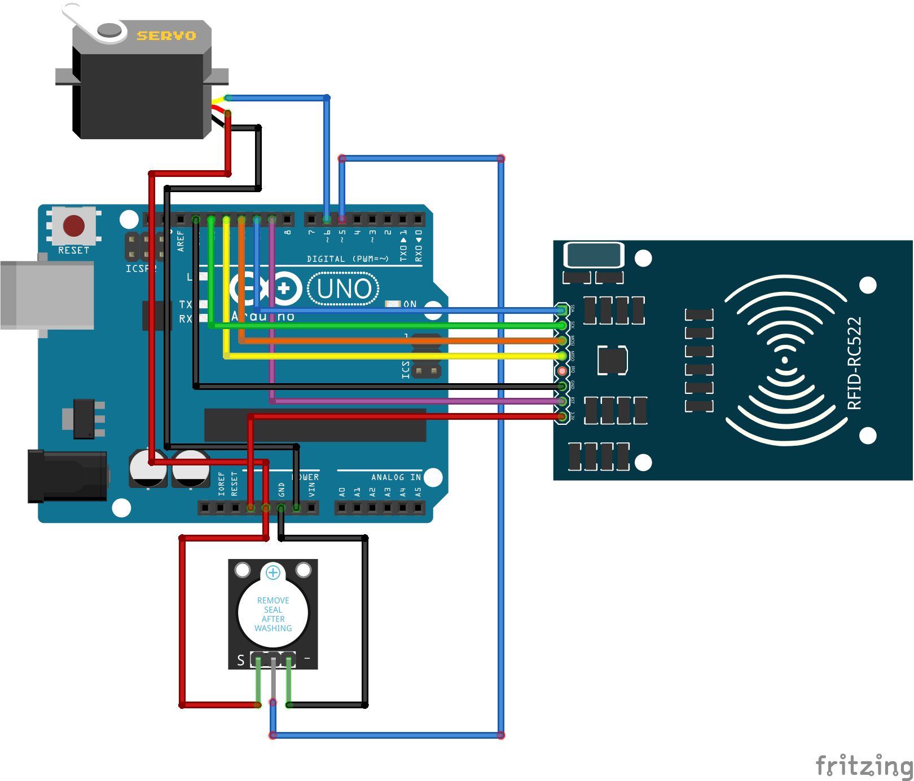

# Access-Control

使用 Arduino UNO R3 制作简易门禁系统。

你需要：

1. Arduino UNO R3（我选用了 CH340G）
2. 拉力足够的舵机（我选用了 MG90S）
3. NFC 读卡器（我选用了 MFRC522）
4. （可选）蜂鸣器（我选用了 KY-012）

连线如下图所示。

代码需安装库 `MFRC522==1.4.4` 才可编译。

将 MG90S 用胶水固定到门上，用线拉住门闩，再将 MFRC522 放到门外即可使用。
